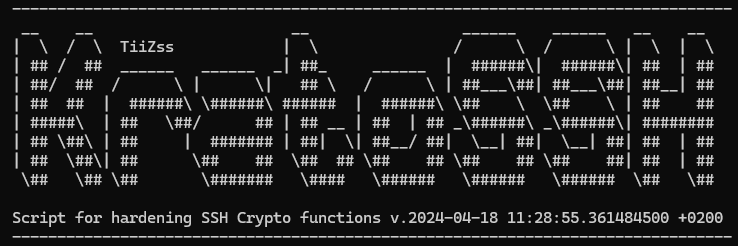

# KratoSSH - CryptoHarden

[](https://github.com/TiiZss/KratoSSH/releases)
[](https://www.gnu.org/software/bash/)
[](https://github.com/TiiZss/KratoSSH/blob/main/LICENSE)
[](https://github.com/TiiZss/KratoSSH/releases)
[](https://www.paypal.com/donate/?business=AC5N3XX2KGY2S&no_recurring=0&item_name=Seguir+con+el+desarrollo+de+la+herramienta&currency_code=EUR)


Bash script to harden an SSH server and allow only strong encryption algorithms to be accepted by the server, as well as being able to harden the SSH connection if you use it as a client.<br />
Working and tested on Ubuntu 20.04/22.04, Debian 10/11/12, CentOS 8, Rocky Linux 9 and WSL<br /><br />
  
Available for SSH server on:
* Debian 10/11/12
* Ubuntu 14.04 to 24.04
* Ubuntu Core 16/18
* Rocky Linux 9
* Amazon Linux 2023
* CentOS 7/8
* RedHat Enterprise Linux 7/8
* OpenBSD 6.2
* pfSense 2.4
* Alpine Linux

Available for SSH client on:
* Debian 12
* Ubuntu 16.04/18.04/20.04/22.04
* Linux Mint 18/19/20/21
* Rocky Linux 9
* Amazon Linux 2023
* Alpine Linux

Additional client hardening targets:
* PuTTY (Linux session files, and Windows/WSL via PowerShell)
* Bitvise SSH Client (Windows/WSL via PowerShell)

## Compatibility matrix

Server hardening matrix:

| Family | Versions | Status |
|---|---|---|
| Ubuntu | 14+ | Supported |
| Debian | 10+ | Supported |
| CentOS | 7-8 | Supported |
| RHEL | 8/9/10 | Supported |
| Rocky Linux | 9/10 | Supported |
| AlmaLinux | 9/10 | Supported (normalizes to Rocky) |
| Oracle Linux | 9/10 | Supported (normalizes to Rocky) |
| Amazon Linux | 2023+ | Supported |
| Fedora | 36+ | Supported |
| openSUSE | Leap/Tumbleweed | Supported |
| Arch | Rolling | Supported |
| Alpine | Current | Supported |
| Ubuntu Core | 16/17/18 | Supported |
| OpenBSD | 6+ | Supported |
| pfSense | 2.x | Supported |

Client hardening matrix:

| Client | Platform | Status |
|---|---|---|
| OpenSSH | Linux distros listed above | Supported |
| PuTTY | Linux session files (`~/.putty/sessions/`) | Supported |
| PuTTY | Windows/WSL (PowerShell, per-session registry) | Supported |
| Bitvise | Windows/WSL (PowerShell, global + per-profile XML) | Supported |
| macOS SSH | macOS (`~/.ssh/config`, via `--client-app macos-ssh`) | Supported |
| SecureCRT | Linux/macOS (INI session files) | Supported |
| SecureCRT | Windows/WSL (PowerShell, per-session .ini) | Supported |
| WinSCP | Linux/macOS (portable `winscp.ini`) | Supported |
| WinSCP | Windows/WSL (PowerShell, registry + portable INI) | Supported |
| Termius | Linux/macOS (`storage.json` vault, via python3) | Supported |
| Termius | Windows/WSL (PowerShell, `storage.json` vault) | Supported |
| MobaXterm | Linux/macOS (`MobaXterm.ini`, `[SSH*]` sections) | Supported |
| MobaXterm | Windows/WSL (PowerShell, `MobaXterm.ini`) | Supported |

Normalization/fallback policy:

* Linux Mint is normalized to Ubuntu equivalents (18->16, 19->18, 20->20, 21->22, 22->24).
* Kali is normalized to Debian 12 profile.
* Parrot OS is normalized to Debian profile by major version.
* AlmaLinux and Oracle Linux are normalized to the Rocky Linux profile for the same major version.
* RHEL is detected by name before the generic CentOS fallback and routed to its own function.
* Unsupported or too-old distro/version combinations fail fast with non-zero exit.

## How To
You can use this script directly without downloading it or you can download and run it.

### Without download
You have to be root or use sudo to run it
```
curl -sL https://raw.githubusercontent.com/TiiZss/KratoSSH/main/KratoSSH.sh | bash -s
```
### With download
#### 1) Clone the repo
Clone this repo, or download it any way you prefer
```
git clone https://github.com/TiiZss/KratoSSH.git
cd KratoSSH
chmod +x KratoSSH.sh
```
#### Usage
You have to be root or use sudo to run it
```
./KratoSSH.sh [OPTIONS]
```

### Options
* `-d, --dry-run`: Simulate changes without modifying any files.
* `-a, --auto`: Run in non-interactive mode (requires `--type`).
* `-t, --type [server|client]`: Specify operation type for auto mode.
* `--audit`: Run a read-only security audit against localhost using `ssh-audit` (automatically detects custom SSH ports).
* `--audit-client`: Run a read-only client profile audit for the selected app (`--client-app`) without making changes.
* `--strict`: With `--audit-client`, fail when profile sources are missing or unavailable.
* `--verify`: Run post-hardening verification checks (config, keys, service and effective crypto settings) and print a PASS/FAIL summary by block.
* `--fix`: Apply server crypto hardening in auto mode.
* `--fix-port [PORT]`: With `--fix`, also set SSH server port and apply perimeter hardening.
* `--client-app [APP]`: Select client application when running with `--type client` (see `--list-clients`).
* `--list-clients`: Print all supported values for `--client-app` and exit.
* `--force-regenerate`: Force host key rotation during hardening (keys are otherwise kept if already present).
* `-r, --restore`: Restore SSH host keys from backup.

## mosh + tmux guidance

`mosh` uses UDP (`60000:61000` by default) and still needs SSH for authentication/bootstrap. A hardened baseline that works well in roaming or unstable links:

1. Keep SSH hardening active with KratoSSH first (`--fix` on server, `--type client` on clients).
2. Open UDP range `60000:61000` only on trusted perimeter zones.
3. Keep `tmux` as persistent shell layer so sessions survive network roaming and temporary disconnects.

Recommended `~/.ssh/config` snippet for mosh bootstrap:

```sshconfig
Host my-mosh-host
	HostName your.server.example
	User youruser
	ServerAliveInterval 30
	ServerAliveCountMax 3
	Compression no
```

Recommended `tmux` defaults (`~/.tmux.conf`):

```tmux
set -g mouse on
set -g history-limit 200000
set -g status-interval 5
set -g remain-on-exit on
```

Example workflow:

```bash
mosh youruser@your.server.example -- tmux new -A -s ops
```

### Examples

**Interactive Mode (Default)**
```bash
./KratoSSH.sh
```

**Dry Run (Check what would happen)**
```bash
./KratoSSH.sh --dry-run
```

**Automated Server Hardening**
```bash
./KratoSSH.sh --auto --type server
```

**Security Audit**
```bash
./KratoSSH.sh --audit
```

**Verify Current Hardening State**
```bash
./KratoSSH.sh --verify
```

**Audit + Fix Crypto Hardening**
```bash
./KratoSSH.sh --fix
```

**Audit + Fix Crypto Hardening + Correct SSH Port**
```bash
./KratoSSH.sh --fix --fix-port 2222
```

**Audit + Fix Crypto Hardening (force key rotation)**
```bash
./KratoSSH.sh --fix --force-regenerate
```

**Client hardening for PuTTY**
```bash
./KratoSSH.sh --auto --type client --client-app putty
```

**Client hardening for Bitvise**
```bash
./KratoSSH.sh --auto --type client --client-app bitvise
```

Note: if your system has /etc/ssh/sshd_config.d but the Include directive is missing in /etc/ssh/sshd_config, KratoSSH now enables it safely (with validation and rollback).

## Latest release highlights (v20260324_1210)

- Added `--fix-port [PORT]` to combine crypto hardening with perimeter port correction (including restoring port 22) in a single `--fix` run.
- Added `--client-app [openssh|putty|bitvise]` to select the SSH client hardening target explicitly.
- Added initial PuTTY client hardening: patches `~/.putty/sessions/*` on Linux and runs `windows/putty_hardening.ps1` on Windows/WSL.
- Added initial Bitvise client hardening via `windows/bitvise_hardening.ps1` on Windows/WSL.
- Multiple KratoSSH hardening blocks (e.g. crypto + perimeter) now coexist safely in the drop-in config without overwriting each other.
- Unsupported or too-old distro/version combinations now exit with a non-zero code (fail fast) instead of silently succeeding.
- Strict CLI argument validation for `--fix-port` and `--client-app` (fails early on missing or empty values).
- New test suites for PuTTY/Bitvise, distro fail-fast, distro family matrix (including Mint/Kali/Parrot aliases), and CLI argument validation.

### Previous release (v20260324_1105)

- Added `--fix` and `--verify` operational flows to harden and validate SSH state end-to-end.
- Improved transactional safety with rollback behavior when configuration validation fails.
- Added regression-focused shell tests for audit, verify, fix success/failure paths, and restart failure propagation.
- Added CI shell checks workflow for syntax and lint validation.

## Development checks

Run the local smoke tests:

```bash
bash tests/test-syntax.sh
```

Run `shellcheck` locally if it is installed:

```bash
shellcheck -x KratoSSH.sh lib/*.sh tests/*.sh
```

The repository also includes a GitHub Actions workflow that runs Bash syntax checks and `shellcheck` on every push and pull request.

## Next steps
* Add `--audit-client --json-pretty` mode with stable ordering for deterministic CI diffs.
* Add native Windows file-based profile discovery for `SecureCRT` and `Termius` in audit mode (without relying on Linux paths).
